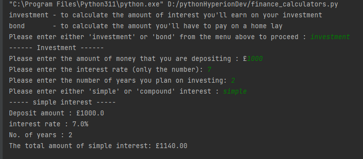

## FinalCapstone - Financial Calculators
This program that allows the user to access two different financial calculators: an investment calculator and a home loan repayment calculator.

## Table of Contents
1. Requirements / Installation
2. How to Use
3. Credits

## 1. Requirements / Installation
* [Python 3.7.1+](https://www.python.org/downloads/)
    * \[Windows\]: Python is added to PATH.
* Download "finance_calculators.py"  then open it in IDE (Pycharm/VS Code).

## 2. How to Use
Run the "finance_calculators.py" file in IDE.
The user choose which calculation they want to do
1. investment - to calculate the amount of interest you'll earn on your investment
2. bond       - to calculate the amount you'll have to pay on a home lay

If the user selects ‘investment’, do the following:
- The user to input:
  - The amount of money that they are depositing.
  - The interest rate (as a percentage). Only the number of the interest rate should be entered — don’t worry about having to deal with the added ‘%’, e.g. The user should enter 8 and not 8%.
  - The number of years they plan on investing.
  - Then ask the user to input if they want “simple” or “compound” interest, and store this in a variable called interest. 
Depending on whether or not they typed “simple” or “compound”, output the appropriate amount that they will get back after the given period, at the specified interest rate.

If the user selects ‘bond’, do the following:
- The user to input:
  - The present value of the house. e.g. 100000
  - The interest rate. e.g. 7
  - The number of months they plan to take to repay the bond. e.g. 120
Output the calculation how much money the user will have to repay each month.

## 3. Credits
Created by Vian Mok - [(https://github.com/vianmei/finalCapstone)](https://github.com/vianmei/finalCapstone)
